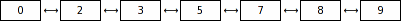

# Data Structures Visualizer

## Overview

**Data Structures Visualizer** is a tool designed to visually represent various data structures such as stacks, queues, binary trees, and graphs using SVG graphics. This project helps users understand the structure and behavior of these data types through graphical representation.

The program reads a file that describes the data structure and generates an SVG image representing it. Supported structures include Stacks, Queues, Red-Black Trees, and more.

## Features

- **Supported Data Structures**: Includes Stacks, Queues, Binary Trees, Red-Black Trees, and Graphs.
- **Custom SVG Output**: Generates visually appealing SVG files for each data structure.
- **Easy Input Format**: Input files use a simple format that allows for easy customization of structures and elements.
- **Modular and Scalable**: The project is designed to support additional data structures with ease.

## Example Usage
Create an input file that describes the data structure you want to visualize. Then, run the program to generate an SVG file that displays the structure.

### Example:

**Data structure type:**
LinkedList

**Elements:**
0 2 3 5 7 8 9

**Generated Output:** 



## Tech Stack

- **Java**: Core logic for handling and visualizing data structures.
- **SVG**: Output format for graphical representation.

## Getting Started

### Installation

1. Clone the repository:
   ```bash
   git clone https://github.com/danielaflrs/data-structures-visualizer.git

